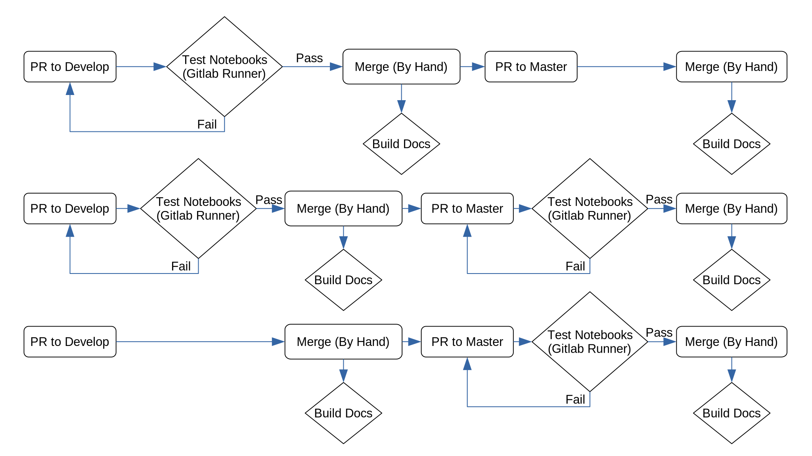

# maap-documentation
[](https://maap-project.readthedocs.io/en/latest/?badge=latest)

This repository serves as the technical documentation for interfacing with the Muti Mission

## Contributing to MAAP Documentation
MAAP documentation is hosted at [docs.maap-project.org](https://docs.maap-project.org) using [ReadTheDocs](https://readthedocs.org/projects/maap-project). It is built using [Sphinx](http://www.sphinx-doc.org/en/master/index.html) and written in [reStructuredText](https://www.sphinx-doc.org/en/master/usage/restructuredtext/index.html). If you want to contribute to the documentation, you can do so by forking the repository, creating a branch for your changes and editing the documentation files in the docs directory of the repo.

### Formatting
The documentation is primarly written as Jupyter Notebooks .ipyndb. Contributors can use and edit the notebooks in any compatible environment. The MAAP Algorithm Development Environment (ADE) platform is the recommended editor as all the code will work there.

To work on the website layout, table of contents, and other features see Local Editing.


### Local Editing
You need to install Sphinx and supporting packages locally so that you can make sure that your edits show up correctly before you make a pull request to the repo. To do this run the following command:

```
$ pip install Sphinx ipykernel nbsphinx sphinxcontrib-napoleon sphinx-rtd-theme pandoc
```
After installing the necessary packages you build the docs using the following command from the docs directory:

```
$ make html
```

Once the docs have been built successfully, there should be a `build/` directory with the HTML pages.

## Website Generation

The website version of the documentation is automatically generated for the master (aka latest) and develop branches whenever code is pushed or merged to them. This is controlled through github webhooks connected to ReadTheDocs.

